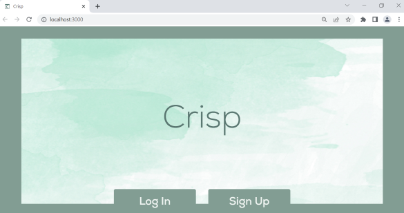
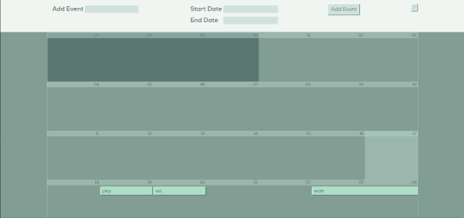

  
  # Crisp
   

  

  ## Description: 
  Crisp is a task scheduling app designed to address common user concerns with the existing apps in this market. To present a product that emphasizes the user experience, we focused on implementing a minimalist design with limited features. The result is an easy to use scheduler that doesn't overwhelm the user with excessive options and confusing graphics.
  &nbsp;
  &nbsp;

  &nbsp;
  &nbsp;
  ## Table of Contents
  - [Usage](#usage)
  - [License](#license)
  - [Contributing](#contributing)
  - [Questions](#questions)
   

  &nbsp;
  &nbsp;
  Example screenshots:
  

  
  
  &nbsp;
  &nbsp;

  &nbsp;
  &nbsp;
  ## Usage:
  To use Crisp, visit: 

  &nbsp;
  &nbsp;

  &nbsp;
  &nbsp;
  ## License:

      This project is licensed under the MIT license.

    
  &nbsp;
  &nbsp;

  ## Contributing:
  If you would like to contribute to this project, please use a fork to push your code to the repo and make a pull request.
  &nbsp;
  &nbsp;
  
  &nbsp;
  &nbsp;
  ## Questions:
  If you have questions about this project, please contact us:
   

  Noel Stafford:  [noeljordan34@gmail.com](noeljordan34@gmail.com)

  Ian Binstock:  [ibinstock@outlook.com](ibinstock@outlook.com)

  Jack Kane:  [jkanvision@knights.ucf.edu](mailto:jkanvision@knights.ucf.edu). 
   
  &nbsp;
  &nbsp;

  You can view our other projects by visiting our individual GitHub profile pages:
   

  Noel Stafford:  [https://github.com/NoelStafford](https://github.com/NoelStafford)

  Ian Binstock:  [https://github.com/Binnyboy1](https://github.com/Binnyboy1)

  Jack Kane:  [https://github.com/jkanvision](https://github.com/jkanvision).